# Gier Up | PORTFOLIO PROJECT 5
Gear Up is my fifth Project for Code Institute. Gear Up offer a seamless and engaging shopping experience, enhanced by its user-friendly interface and responsive design. This platform is designed to be an ultimate online destination for those passionate about motorbikes, providing a comprehensive selection of motorbike gear ranging from protective wear to accessories.
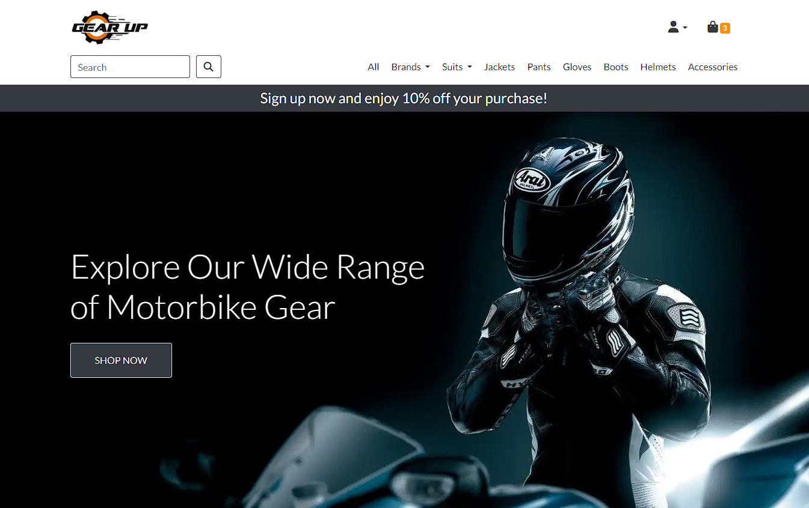
[View live website here.](https://gearupp-adc940fbf9f8.herokuapp.com/)

## Table of Contents
___

- [Business Model)](#business-model)
- [Marketing)](#marketing)
- [User Experience (UX)](#user-experience)
    - [User stories](#user-stories)
    - [Features](#features)
    - [Design](#design)
        - [Typography](#typography)
        - [Colour Scheme](#color)
        - [Imagery](#imagery)
    - [Agile](#agile)
- [Teschnologies](#technologies)
    - [Languages Used](#languages)
    - [Frameworks, Libraries & Programs Used](#flp)
- [Testing](#testing)
    - [Lighthouse](#lighthouse)
    - [HTML Validation](#html-validation)
    - [CSS Validation](#css-validation)
    - [Manual Testing](#manual)
    - [Bugs Found](#bugs)
- [Deployment](#deployment)
    - [Version Controle](#version-controle)
    - [Heroku](#heroku)
- [Credits](#credits)
    - [Media](#media)
    - [Content](#content)
    - [Other](#other)
- [Acknowledgements](#acknowledgements)

## Business Model (UX)
___

The e-commerce platform is centered around a vibrant community of motorcycle enthusiasts, operating on a B2C model. Gear Up site aims to offer more than just a retail experience; it's a hub for those passionate about motorcycle culture and lifestyle. The core mission is to engage customers who are not only interested in purchasing high-quality motorcycle gear but also in immersing themselves in the world of motorcycling.

Gear Up platform will feature a range of products essential for the motorcycle enthusiast, including helmets, jackets, gloves, and various accessories, catering to both seasoned riders and newcomers.

 

## Marketing
___

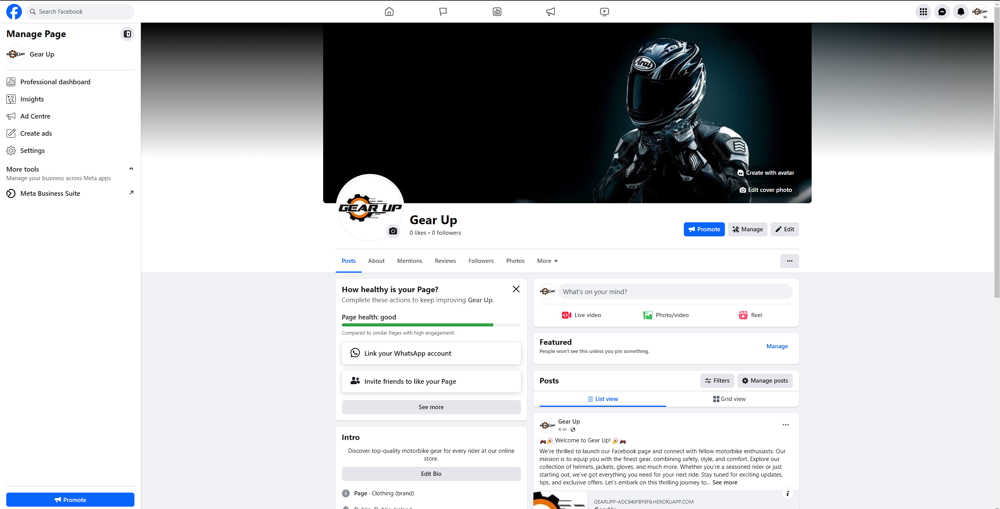

To effectively reach and engage withtarget audience, I created a dedicated Facebook page for Gear Up e-commerce platform, focusing on motorcycle gear. This page serves as a key component of Gear Up marketing strategy, offering a direct channel to communicate withcustomers, share updates, and promote products.

## User Experience (UX)
___

### User Stories

 
<ul>
    <li>As a visitor I can easily register for an account on GearUp so that I can enjoy a personalized shopping experience and expedite future checkouts</li>
    <li>As a customer I can browse various motorbike gear and accessories on GearUp so that I can find the products that I need or desire</li>
    <li>As a customer I can use a search function to find specific gear so that I save time and find exactly what I'm looking for quickly</li>
    <li>As a customer I can securely check out and make payments so that I ensure my financial information is safe</li>
    <li>As a registered user I can view my order history so that I can keep track of past purchases and repurchase items if necessary</li>
    <li>As a registered user I can manage my account details so that I can update my shipping address, contact information, and preferences</li>
    <li>As a administrator I can add, update, and remove products so that the GearUp inventory is always current and accurate</li>
    <li>As a mobile user I can navigate GearUp on my mobile device with ease so that I can enjoy a seamless shopping experience on-the-go</li>
    <li>As a admin I can ensure that product descriptions and content are SEO-friendly so that GearUp ranks well in search engine results and attracts organic traffic</li>
    <li>As a customer I can leave feedback on the gear and accessories I've purchased so that I can inform others about the quality and performance of the products</li>
    
</ul>
 

### Features

 
 

>As a visitor I can easily register for an account on GearUp so that I can enjoy a personalized shopping experience and expedite future checkouts

<ul>
    <li>Nav bar will provide profile dropdown button to links to register button and login button for already registed users.</li>
</ul>

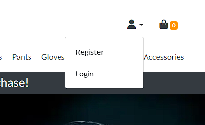
 

>As a customer I can browse various motorbike gear and accessories on GearUp so that I can find the products that I need or desire

<ul>
    <li>Users are provided with a navbar with links to verious product categories and brands.</li>
</ul>

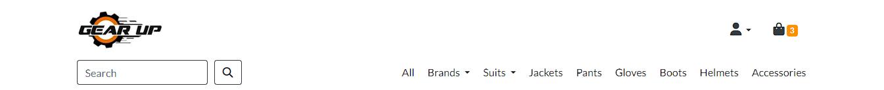
 
<ul>
    <li>Users are also provided with a pagination menu where they can select next page with the filtered category or brand.</li>
</ul>

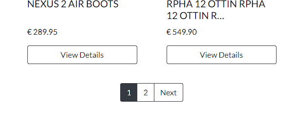
>As a customer I can use a search function to find specific gear so that I save time and find exactly what I'm looking for quickly
 
<ul>
    <li>Search bar is provided for users to search for product by it's name, brand or category.</li>
</ul>

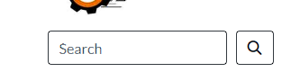
>As a customer I can securely check out and make payments so that I ensure my financial information is safe

<ul>
    <li>Stripe form is inbeded in the checkout template for secure checkout.</li>
</ul>

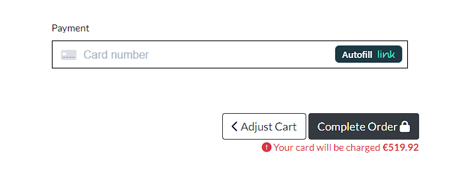
>As a registered user I can view my order history so that I can keep track of past purchases and repurchase items if necessary

<ul>
    <li>Users are provided with order history in their profile page where they can click on view to view detailed order history.</li>
</ul>

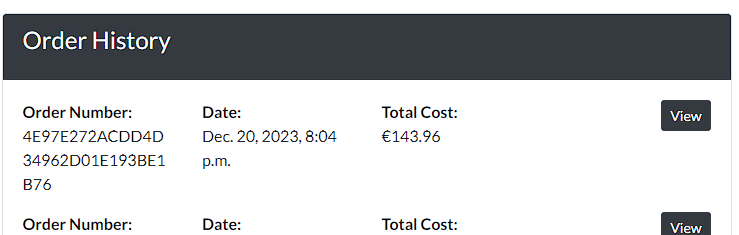
 

>As a registered user I can manage my account details so that I can update my shipping address, contact information, and preferences

<ul>
    <li>Users are provided with a button to a form to fill out that will save their delivery address and prefill it in checkout</li>
</ul>

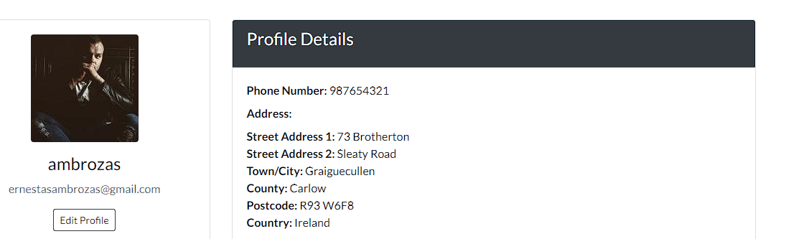
 

>As a administrator I can add, update, and remove products so that the GearUp inventory is always current and accurate

<ul>
    <li>Admin is provided with a Create Product button where when clicked a form will open up to creatre product</li>
</ul>

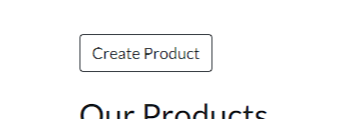
<ul>
    <li>Admin is also provided with 3 other buttons in the droduct details page for updating, deleting and adding sizes buttons for that product</li>
</ul>

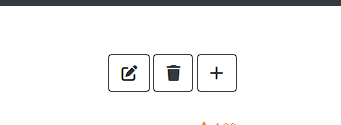
 

>As a mobile user I can navigate GearUp on my mobile device with ease so that I can enjoy a seamless shopping experience on-the-go

<ul>
    <li>The website is built using bootstrap 4 and also added some custom css to make the website responsive on all devices.</li>
</ul>
 

>As a admin I can ensure that product descriptions and content are SEO-friendly so that GearUp ranks well in search engine results and attracts organic traffic

<ul>
    <li>Description and meta tags were used to helo with SEO, also all the images have their product name using django.</li>
</ul>
 

>As a customer I can leave feedback on the gear and accessories I've purchased so that I can inform others about the quality and performance of the products

<ul>
    <li>Users are provided with review form where they can rate and add a comment on a specific product</li>

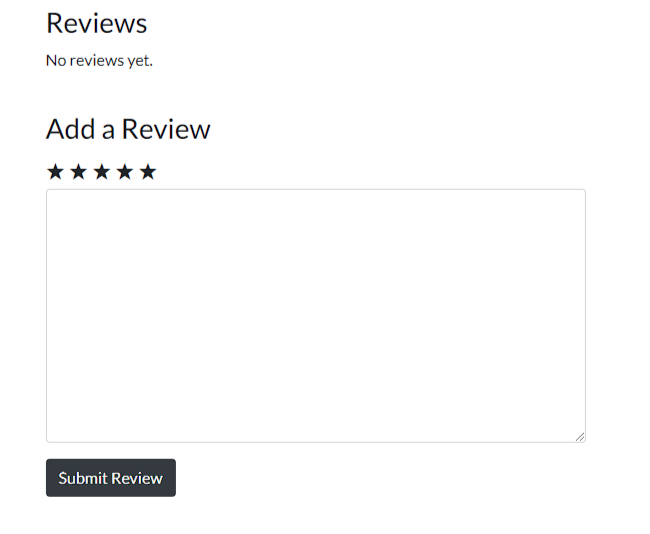
    <li>Once the user submits the review they are restircted in creating another review in the same product</li>

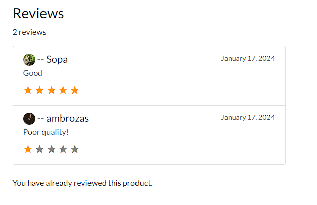
    <li>If the user is logged out the link is displayed to login to leave a review</li>

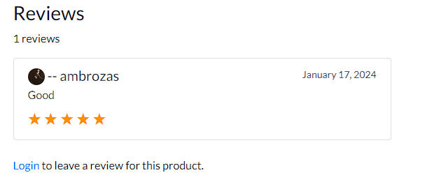
</ul>
 

### Design

 
<ul>
    <li id="typography">Typography
    <ul>
        <li>I used Lato as the font for this project</li>
    </ul>
    </li>
    <li id="color">Colour Scheme
    <ul>
        <li>Three colours were used for this website which is dark, white and orange for: 
            <ul>
                <li>Minimalistic and Elegant Design</li>
                <li>Visual Contrast and Emphasis</li>
                <li>Brand Identity and Recognition</li>
            </ul>
        </li>
    </ul>
    </li>
    <li id="imagery"> Imagery
    <ul>
        <li>The backgound image was taken from <a href="https://www.pexels.com/">pexels.com</a>.</li>
        <li>All the product photos were taken from .</li>
        <ul>
            <li><a href="https://www.dainese.com/">dainese.com</a>.</li>
            <li><a href="https://www.alpinestars.com/">alpinestars.com</a>.</li>
            <li><a href="https://www.agv.com/">agv.com</a>.</li>
            <li><a href="https://hjchelmets.eu/">hjchelmets.com</a>.</li>
        </ul>
    </ul>
    </li>
</ul>

## Agile
___

The development process was managed utilizing an agile methodology through GitHub projects.

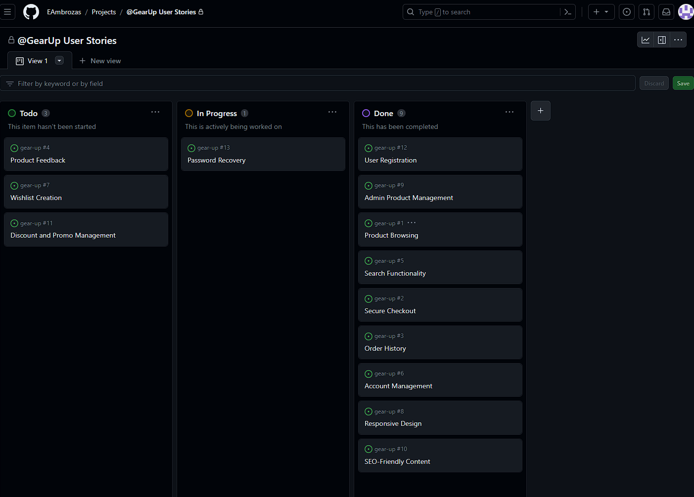

## Technologies
___

### Languages Used

 
<ul>
    <li><a href="https://en.wikipedia.org/wiki/HTML">HTML5</a></li>
    <li><a href="https://en.wikipedia.org/wiki/CSS">CSS3</a></li>
    <li><a href="https://en.wikipedia.org/wiki/JavaScript">JS</a></li>
    <li><a href="https://en.wikipedia.org/wiki/Django_(web_framework)">Python Django Framework</a></li>
</ul>
 

### Frameworks, Libraries & Programs Used

 
<ul>
    <li><a href="https://fonts.google.com/">Google Fonts</a>
        <ul>
            <li>Google fonts were used to import the 'Roboto' and 'Open Sans' fonts into the style.css file.</li>
        </ul>
    </li>
</ul>
<ul>
    <li><a href="https://fontawesome.com/">Font Awesome</a>
        <ul>
            <li>Font Awesome was used for icons.</li>
        </ul>
    </li>
</ul>
<ul>
    <li><a href="https://git-scm.com/">Git</a>
        <ul>
            <li>Git was used for version control by utilizing the Gitpod terminal to commit to Git and Push to GitHub.</li>
        </ul>
    </li>
</ul>
<ul>
    <li><a href="https://github.com/">GitHub</a>
        <ul>
            <li>GitHub was used to store the projects code after being pushed from Git.</li>
        </ul>
    </li>
</ul>
<ul>
    <li><a href="https://stripe.com/">Stripe</a>
        <ul>
            <li>Stripe was used to implement payments</li>
        </ul>
    </li>
</ul>
<ul>
    <li><a href="https://www.elephantsql.com/">ElephantSQL</a>
        <ul>
            <li>ElephantSQL was used for database</li>
        </ul>
    </li>
</ul>
<ul>
    <li><a href="https://aws.amazon.com/">AWS</a>
        <ul>
            <li>AWS was used for storing static files</li>
        </ul>
    </li>
</ul>
<ul>
    <li><a href="https://www.gitpod.io/">Gitpod</a>
        <ul>
            <li>Gitpod was used to develop the website.</li>
        </ul>
    </li>
</ul>
<ul>
    <li><a href="https://dashboard.heroku.com/apps">Heroku</a>
        <ul>
            <li>Heroku was used to Deploy Application.</li>
        </ul>
    </li>
</ul>

## Testing
___

### Lighthouse

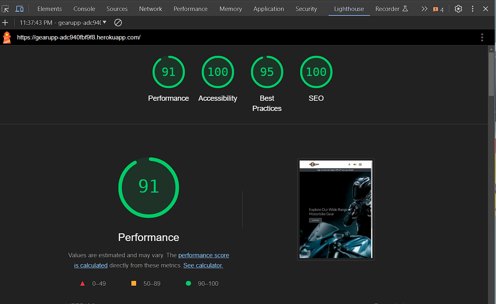

### HTML Validation

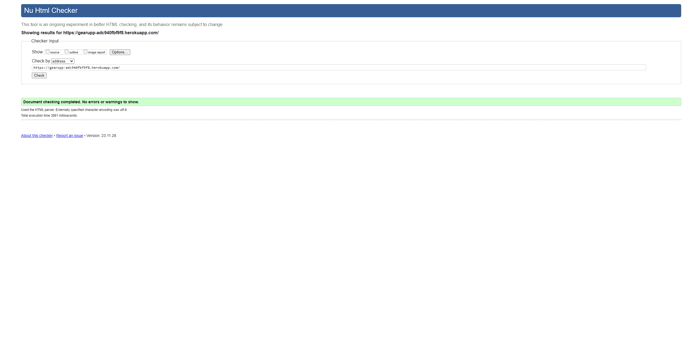

### CSS Validation

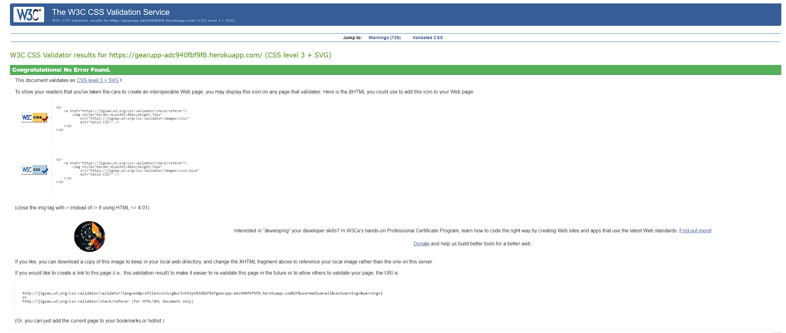

### Manual Testing

The following section provides a detailed description of the manual testing procedure and results:

Navbar

<table>
<tr>
    <th>Page / Section</th>
    <th>Element</th>
    <th>Action</th>
    <th>Expected Result</th>
    <th>Pass / Fail</th>
</tr>
<tr>
    <td>Navbar</td>
    <td>Logo</td>
    <td>Click</td>
    <td>Redirect to home page</td>
    <td>Pass</td>
</tr>
<tr>
    <td>Navbar</td>
    <td>Profile Icon Dropdown (Authenticated User)</td>
    <td>Click</td>
    <td>Show dropdown with 'My Profile', 'Product Management' (for superuser), and 'Logout'</td>
    <td>Pass</td>
</tr>
<tr>
    <td>Navbar</td>
    <td>Profile Icon Dropdown (Non-Authenticated User)</td>
    <td>Click</td>
    <td>Show dropdown with 'Register' and 'Login'</td>
    <td>Pass</td>
</tr>
<tr>
    <td>Navbar</td>
    <td>Shopping Cart</td>
    <td>Click</td>
    <td>Redirect to view cart page</td>
    <td>Pass</td>
</tr>
<tr>
    <td>Navbar</td>
    <td>Hamburger Menu</td>
    <td>Click</td>
    <td>Toggle mobile navigation menu</td>
    <td>Pass</td>
</tr>
<tr>
    <td>Navbar</td>
    <td>Search Bar</td>
    <td>Enter text and submit</td>
    <td>Display search results based on query</td>
    <td>Pass</td>
</tr>
<tr>
    <td>Navbar</td>
    <td>'All' Products Link</td>
    <td>Click</td>
    <td>Redirect to product list page showing all products</td>
    <td>Pass</td>
</tr>
<tr>
    <td>Navbar</td>
    <td>Brands Dropdown</td>
    <td>Select brand</td>
    <td>Redirect to product list page filtered by selected brand</td>
    <td>Pass</td>
</tr>
<tr>
    <td>Navbar</td>
    <td>Suits Dropdown</td>
    <td>Select category</td>
    <td>Redirect to product list page filtered by selected category</td>
    <td>Pass</td>
</tr>
<tr>
    <td>Navbar</td>
    <td>Category Link</td>
    <td>Click</td>
    <td>Redirect to product list page filtered by selected category</td>
    <td>Pass</td>
</tr>
</table>

 

Footer

<table>
<tr>
    <th>Page / Section</th>
    <th>Element</th>
    <th>Action</th>
    <th>Expected Result</th>
    <th>Pass / Fail</th>
</tr>
<tr>
    <td>Footer</td>
    <td>Mailchimp Subscription Form</td>
    <td>Enter email and submit</td>
    <td>User is subscribed to the newsletter, and a confirmation message is displayed</td>
    <td>Pass</td>
</tr>
<tr>
    <td>Footer</td>
    <td>Facebook Link</td>
    <td>Click</td>
    <td>Open the Facebook page in a new browser tab</td>
    <td>Pass</td>
</tr>
<tr>
    <td>Footer</td>
    <td>Copyright Text</td>
    <td>Review</td>
    <td>Display the current year and correct copyright information</td>
    <td>Pass</td>
</tr>
</table>

 

Home page

<table>
<tr>
    <th>Page / Section</th>
    <th>Element</th>
    <th>Action</th>
    <th>Expected Result</th>
    <th>Pass / Fail</th>
</tr>
<tr>
    <td>Home Page</td>
    <td>'Shop Now' Button</td>
    <td>Click</td>
    <td>Redirect to the product list page</td>
    <td>Pass</td>
</tr>
</table>

 

Product List

<table>
<tr>
    <th>Page / Section</th>
    <th>Element</th>
    <th>Action</th>
    <th>Expected Result</th>
    <th>Pass / Fail</th>
</tr>
<tr>
    <td>Product Listing Page</td>
    <td>Create Product (Superuser only)</td>
    <td>Click</td>
    <td>For superusers, redirect to the Create Product page</td>
    <td>Pass</td>
</tr>
<tr>
    <td>Product Listing Page</td>
    <td>Total Products Count</td>
    <td>Review</td>
    <td>Displays the total number of products</td>
    <td>Pass</td>
</tr>
<tr>
    <td>Product Listing Page</td>
    <td>Individual Product Card</td>
    <td>Review</td>
    <td>Displays product details such as image, category, rating, name, and price</td>
    <td>Pass</td>
</tr>
<tr>
    <td>Product Listing Page</td>
    <td>Product Image</td>
    <td>Review</td>
    <td>Displays the correct image for each product; default image if none provided</td>
    <td>Pass</td>
</tr>
<tr>
    <td>Product Listing Page</td>
    <td>View Details Button on Product Card</td>
    <td>Click</td>
    <td>Redirect to the detailed view of the clicked product</td>
    <td>Pass</td>
</tr>
<tr>
    <td>Product Listing Page</td>
    <td>Pagination - Previous</td>
    <td>Click</td>
    <td>Redirect to the previous page of products</td>
    <td>Pass</td>
</tr>
<tr>
    <td>Product Listing Page</td>
    <td>Pagination - Specific Page Number</td>
    <td>Click</td>
    <td>Redirect to the selected page of products</td>
    <td>Pass</td>
</tr>
<tr>
    <td>Product Listing Page</td>
    <td>Pagination - Next</td>
    <td>Click</td>
    <td>Redirect to the next page of products</td>
    <td>Pass</td>
</tr>
<tr>
    <td>Product Listing Page</td>
    <td>No Products Available Message</td>
    <td>Review</td>
    <td>Displays a message if no products are available in the category</td>
    <td>Pass</td>
</tr>
</table>

 

Product Detail

<table>
<tr>
    <th>Page / Section</th>
    <th>Element</th>
    <th>Action</th>
    <th>Expected Result</th>
    <th>Pass / Fail</th>
</tr>
<tr>
    <td>Product Detail Page</td>
    <td>Back Button</td>
    <td>Click</td>
    <td>Redirect to the product list page</td>
    <td>Pass</td>
</tr>
<tr>
    <td>Product Detail Page (Staff/Superuser)</td>
    <td>Edit Button</td>
    <td>Click</td>
    <td>Redirect to the product edit page</td>
    <td>Pass</td>
</tr>
<tr>
    <td>Product Detail Page (Staff/Superuser)</td>
    <td>Delete Button</td>
    <td>Click</td>
    <td>Redirect to the product deletion confirmation page</td>
    <td>Pass</td>
</tr>
<tr>
    <td>Product Detail Page (Staff/Superuser)</td>
    <td>Add Sizes Button</td>
    <td>Click</td>
    <td>Redirect to add sizes to product page</td>
    <td>Pass</td>
</tr>
<tr>
    <td>Product Detail Page</td>
    <td>Product Image</td>
    <td>Review</td>
    <td>Displays the product's image or a default image if none is available</td>
    <td>Pass</td>
</tr>
<tr>
    <td>Product Detail Page</td>
    <td>Size Selection Buttons</td>
    <td>Click</td>
    <td>Select the size for the product; update the hidden input field with the selected size</td>
    <td>Pass</td>
</tr>
<tr>
    <td>Product Detail Page</td>
    <td>Quantity Adjustment</td>
    <td>Click on Increase/Decrease</td>
    <td>Adjust the quantity value appropriately</td>
    <td>Pass</td>
</tr>
<tr>
    <td>Product Detail Page</td>
    <td>Add to Cart Button</td>
    <td>Click</td>
    <td>Add the product with selected size and quantity to the cart</td>
    <td>Pass</td>
</tr>
<tr>
    <td>Product Detail Page</td>
    <td>Keep Shopping Button</td>
    <td>Click</td>
    <td>Redirect to the product list page</td>
    <td>Pass</td>
</tr>
<tr>
    <td>Product Detail Page</td>
    <td>Write Review Text Field</td>
    <td>Enter Text</td>
    <td>User can enter review text in the provided field</td>
    <td>Pass</td>
</tr>
<tr>
    <td>Product Detail Page</td>
    <td>Rating Selection</td>
    <td>Select Rating</td>
    <td>User can select a star rating for the product</td>
    <td>Pass</td>
</tr>
<tr>
    <td>Product Detail Page</td>
    <td>Submit Review Button</td>
    <td>Click</td>
    <td>Review and rating are submitted and displayed in the reviews section</td>
    <td>Pass</td>
</tr>
<tr>
    <td>Product Detail Page</td>
    <td>Reviews Display</td>
    <td>Review</td>
    <td>All submitted reviews and ratings are displayed in the reviews section</td>
    <td>Pass</td>
</tr>
<tr>
    <td>Product Detail Page</td>
    <td>Product Rating Display</td>
    <td>Review</td>
    <td>Displays the product's rating if available, otherwise shows 'Not Rated'</td>
    <td>Pass</td>
</tr>

</table>

 

Product Create

<table>
<tr>
    <th>Page / Section</th>
    <th>Element</th>
    <th>Action</th>
    <th>Expected Result</th>
    <th>Pass / Fail</th>
</tr>
<tr>
    <td>Create Product Page</td>
    <td>Back Button</td>
    <td>Click</td>
    <td>Redirect to the previous page as per the HTTP_REFERER</td>
    <td>Pass</td>
</tr>
<tr>
    <td>Create Product Page</td>
    <td>Create Product Form</td>
    <td>Fill and Submit</td>
    <td>Product is created</td>
    <td>Pass</td>
</tr>
<tr>
    <td>Create Product Page</td>
    <td>Form Fields</td>
    <td>Fill In</td>
    <td>All form fields are displayed and can be filled in</td>
    <td>Pass</td>
</tr>
<tr>
    <td>Create Product Page</td>
    <td>Image Upload</td>
    <td>Select File</td>
    <td>User can select and upload an image for the product</td>
    <td>Pass</td>
</tr>
<tr>
    <td>Create Product Page</td>
    <td>Create Product Button</td>
    <td>Click</td>
    <td>Submits the form data, creates the product, and shows appropriate success/failure message</td>
    <td>Pass</td>
</tr>
</table>

 

Product Delete

<table>
<tr>
    <th>Page / Section</th>
    <th>Element</th>
    <th>Action</th>
    <th>Expected Result</th>
    <th>Pass / Fail</th>
</tr>
<tr>
    <td>Delete Product Page</td>
    <td>Back Button</td>
    <td>Click</td>
    <td>Redirect to the product detail page for the specific product</td>
    <td>Pass</td>
</tr>
<tr>
    <td>Delete Product Page</td>
    <td>Delete Confirmation Message</td>
    <td>Review</td>
    <td>Displays a confirmation message asking if the user is sure they want to delete the specific product</td>
    <td>Pass</td>
</tr>
<tr>
    <td>Delete Product Page</td>
    <td>Cancel Button</td>
    <td>Click</td>
    <td>Redirect to the product detail page without deleting the product</td>
    <td>Pass</td>
</tr>
<tr>
    <td>Delete Product Page</td>
    <td>Delete Button</td>
    <td>Click</td>
    <td>Deletes the product</td>
    <td>Pass</td>
</tr>
</table>

 

Product Update

<table>
<tr>
    <th>Page / Section</th>
    <th>Element</th>
    <th>Action</th>
    <th>Expected Result</th>
    <th>Pass / Fail</th>
</tr>
<tr>
    <td>Update Product Page</td>
    <td>Back Button</td>
    <td>Click</td>
    <td>Redirect to the product detail page for the specific product</td>
    <td>Pass</td>
</tr>
<tr>
    <td>Update Product Page</td>
    <td>Update Product Form</td>
    <td>Fill and Submit</td>
    <td>Product details are updated</td>
    <td>Pass</td>
</tr>
<tr>
    <td>Update Product Page</td>
    <td>Form Fields</td>
    <td>Fill In</td>
    <td>All form fields are displayed and can be edited</td>
    <td>Pass</td>
</tr>
<tr>
    <td>Update Product Page</td>
    <td>Image Upload</td>
    <td>Select File</td>
    <td>User can select and upload a new image for the product</td>
    <td>Pass</td>
</tr>
<tr>
    <td>Update Product Page</td>
    <td>Update Product Button</td>
    <td>Click</td>
    <td>Submits the updated form data, updates the product, and shows appropriate success/failure message</td>
    <td>Pass</td>
</tr>
</table>

 

Profile Detail

<table>
<tr>
    <th>Page / Section</th>
    <th>Element</th>
    <th>Action</th>
    <th>Expected Result</th>
    <th>Pass / Fail</th>
</tr>
<tr>
    <td>User Profile Page</td>
    <td>Profile Image</td>
    <td>Review</td>
    <td>Displays the user's profile image</td>
    <td>Pass</td>
</tr>
<tr>
    <td>User Profile Page</td>
    <td>Username and Email</td>
    <td>Review</td>
    <td>Displays the user's username and email address</td>
    <td>Pass</td>
</tr>
<tr>
    <td>User Profile Page</td>
    <td>Edit Profile Button</td>
    <td>Click</td>
    <td>Redirect to the profile edit page</td>
    <td>Pass</td>
</tr>
<tr>
    <td>User Profile Page</td>
    <td>Profile Details Section</td>
    <td>Review</td>
    <td>Displays detailed information like phone number, address, and more</td>
    <td>Pass</td>
</tr>
<tr>
    <td>User Profile Page</td>
    <td>Order History Section</td>
    <td>Review</td>
    <td>Displays a list of past orders if any, along with details like order number, date, total cost</td>
    <td>Pass</td>
</tr>
<tr>
    <td>User Profile Page</td>
    <td>View Order Button</td>
    <td>Click</td>
    <td>Redirect to the detail page of the selected order</td>
    <td>Pass</td>
</tr>
<tr>
    <td>User Profile Page</td>
    <td>Empty Order History Message</td>
    <td>Review</td>
    <td>Shows a message like 'Order history will be displayed here.' if there are no orders</td>
    <td>Pass</td>
</tr>
</table>

 

Profile Update

<table>
<tr>
    <th>Page / Section</th>
    <th>Element</th>
    <th>Action</th>
    <th>Expected Result</th>
    <th>Pass / Fail</th>
</tr>
<tr>
    <td>Update Profile Page</td>
    <td>Back Button</td>
    <td>Click</td>
    <td>Redirect to the user's profile detail page</td>
    <td>Pass</td>
</tr>
<tr>
    <td>Update Profile Page</td>
    <td>Update Profile Form</td>
    <td>Fill and Submit</td>
    <td>User's profile information is updated and redirect to the profile detail page</td>
    <td>Pass</td>
</tr>
<tr>
    <td>Update Profile Page</td>
    <td>Form Fields</td>
    <td>Fill In</td>
    <td>All form fields are displayed and can be edited</td>
    <td>Pass</td>
</tr>
<tr>
    <td>Update Profile Page</td>
    <td>Profile Image Upload</td>
    <td>Select File</td>
    <td>User can select and upload a new profile image</td>
    <td>Pass</td>
</tr>
<tr>
    <td>Update Profile Page</td>
    <td>Update Profile Button</td>
    <td>Click</td>
    <td>Submits the updated form data, updates the user's profile, and shows appropriate success/failure message</td>
    <td>Pass</td>
</tr>
</table>

 

Order Detail

<table>
<tr>
    <th>Page / Section</th>
    <th>Element</th>
    <th>Action</th>
    <th>Expected Result</th>
    <th>Pass / Fail</th>
</tr>
<tr>
    <td>Order Details Page</td>
    <td>Order Information</td>
    <td>Review</td>
    <td>Displays order number, date, email, and shipping address details</td>
    <td>Pass</td>
</tr>
<tr>
    <td>Order Details Page</td>
    <td>Order Items</td>
    <td>Review</td>
    <td>Displays a list of items in the order, including product details, size, quantity, and line item total</td>
    <td>Pass</td>
</tr>
<tr>
    <td>Order Details Page</td>
    <td>Subtotal and Discounted Total</td>
    <td>Review</td>
    <td>Shows the subtotal of the order and the discounted total after any discounts are applied</td>
    <td>Pass</td>
</tr>
<tr>
    <td>Order Details Page</td>
    <td>Back to Profile Button</td>
    <td>Click</td>
    <td>Redirects to the user's profile page</td>
    <td>Pass</td>
</tr>
</table>

 

Cart

<table>
<tr>
    <th>Page / Section</th>
    <th>Element</th>
    <th>Action</th>
    <th>Expected Result</th>
    <th>Pass / Fail</th>
</tr>
<tr>
    <td>Shopping Cart Page</td>
    <td>Cart Items Display</td>
    <td>Review</td>
    <td>Displays each item in the cart, including product image, details, quantity form, and subtotal</td>
    <td>Pass</td>
</tr>
<tr>
    <td>Shopping Cart Page</td>
    <td>Quantity Form</td>
    <td>Adjust and Submit</td>
    <td>Allows user to change product quantity and updates the cart when submitted</td>
    <td>Pass</td>
</tr>
<tr>
    <td>Shopping Cart Page</td>
    <td>Remove Item Button</td>
    <td>Click</td>
    <td>Removes the item from the cart</td>
    <td>Pass</td>
</tr>
<tr>
    <td>Shopping Cart Page</td>
    <td>Total and Checkout Section</td>
    <td>Review</td>
    <td>Displays the subtotal, discount (if logged in), total price, and buttons for 'Keep Shopping' and 'Proceed to Secure Checkout'</td>
    <td>Pass</td>
</tr>
<tr>
    <td>Shopping Cart Page</td>
    <td>Keep Shopping Button</td>
    <td>Click</td>
    <td>Redirects to the product list page</td>
    <td>Pass</td>
</tr>
<tr>
    <td>Shopping Cart Page</td>
    <td>Proceed to Secure Checkout Button</td>
    <td>Click</td>
    <td>Redirects to the checkout page</td>
    <td>Pass</td>
</tr>
<tr>
    <td>Shopping Cart Page</td>
    <td>Empty Cart Message</td>
    <td>Review</td>
    <td>Displays a message that the cart is empty with an option to start shopping if the cart has no items</td>
    <td>Pass</td>
</tr>
</table>

## Bugs Found
___

<ul>
    <li>Adding product to cart</li>
    <ul>
        <li>I found a bug in cart where adding more than one of a product with specific size. If stock has only one item in a specific size, system stops adding two or more at once, but lets adding one at the time many times, making more in cart than in stock. I have decided to leave it as i at this stage i had not enough time to take care of it.</li>
    </ul>
</ul>

## Deployment
___

### Version Controle

The website was developed in the Visual Studio Code editor and then uploaded to the remote "fitfinity" repository on Github.

Throughout the course of development, the following git commands were used to push code to the remote repository:

<ul>
    <li><mark>git add .</mark> To stage changes before committing.</li>
    <li><mark>git commit -m "commit message"</mark> To commit changes.</li>
    <li><mark>git push</mark> Push committed changes to the repository.</li>
    <li><mark>git reset --hard</mark> To update the current branch to the specified commit, unstage any changes, and delete any changes from the working directory.</li>
    <li><mark>git pull</mark> To fetch and merge changes from the remote repository to your local repository.</li>
    <li><mark>git status</mark> To check the status of changes as untracked, modified, or staged.</li>
    <li><mark>python3 manage.py runserver</mark> Starts the Django development server.</li>
    <li><mark>python3 manage.py startapp <app_name></mark> Creates a new Django app within the project.</li>
    <li><mark>python3 manage.py makemigrations</mark> Prepares new migrations</li>
    <li><mark>python3 manage.py migrate</mark> Applies migrations</li>
    <li><mark>python3 manage.py createsuperuser</mark> Creates a superuser account for the admin panel.</li>
    <li><mark>python3 manage.py collectstatic</mark> Collects static files</li>
    <li><mark>mkdir directory_name</mark>: Creates a new directory with the specified name in the current working directory.</li>
</ul>
 

### Heroku

<ol>
    <li>Log into Heroku</li>
    <li>Click "New"</li>
    <li>Click "Create new app"</li>
    <li>Give app a name and select the region</li>
    <li>Click "Create app"</li>
    <li>Navigate to Settings</li>
    <li>Add Config Vars</li>
    <li>Navigate to Deploy</li>
    <li>Choose deployment method as github</li>
    <li>Click "Deploy Branch"</li>
</ol>
 

## Credits
___

<ul>
    <li id="media">Media
        <ul>
            <li>All images were taken from</li>
            <ul>
                <li><a href="https://www.pexels.com/">pexels.com</a></li>
                <li><a href="https://www.google.ie/">google</a></li>
                <li><a href="https://www.dainese.com/">dainese.com</a>.</li>
                <li><a href="https://www.alpinestars.com/">alpinestars.com</a>.</li>
                <li><a href="https://www.agv.com/">agv.com</a>.</li>
                <li><a href="https://hjchelmets.eu/">hjchelmets.com</a>.</li>
            </ul>
        </ul>
    </li>
</ul>
 
<ul>
    <li id="content">Content
        <ul>
            <li>The content for product such as name, description and pricing was taken from
            <ul>
                <li><a href="https://www.dainese.com/">dainese.com</a>.</li>
                <li><a href="https://www.alpinestars.com/">alpinestars.com</a>.</li>
                <li><a href="https://www.agv.com/">agv.com</a>.</li>
                <li><a href="https://hjchelmets.eu/">hjchelmets.com</a>.</li>
            </ul>
        </ul>
    </li>
</ul>
 
<ul>
    <li id="other">Other
        <ul>
            <li>Code Institute walk trough project.</li>
        </ul>
    </li>
</ul>

### Acknowledgements

<ul>
    <li>Code Institute Student Care</li>
    <ul>
        <li>
        
Recently, I encountered unforeseen changes in my work schedule, which significantly limited the time I could dedicate to my project. Your understanding and flexibility in extending the submission date have been immensely helpful during this challenging period.

This extension has allowed me to manage my work commitments while ensuring that I can devote the necessary time and effort to complete my project to the best of my ability. Your support has not only eased my immediate stress but has also reinforced my commitment to maintaining the quality of my work.

I deeply appreciate the empathy and consideration shown by the student care team. Your assistance has had a positive impact on my academic journey, and I am grateful for your understanding and support.

        </li>
    </ul>
    <li>
    Also would like to thank Code Institute Tutor Suport for helping me on when I was stuck.
    </li>
</ul>